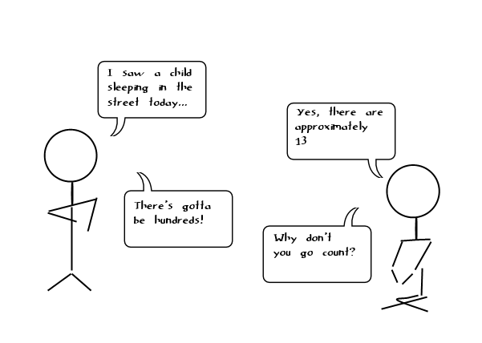
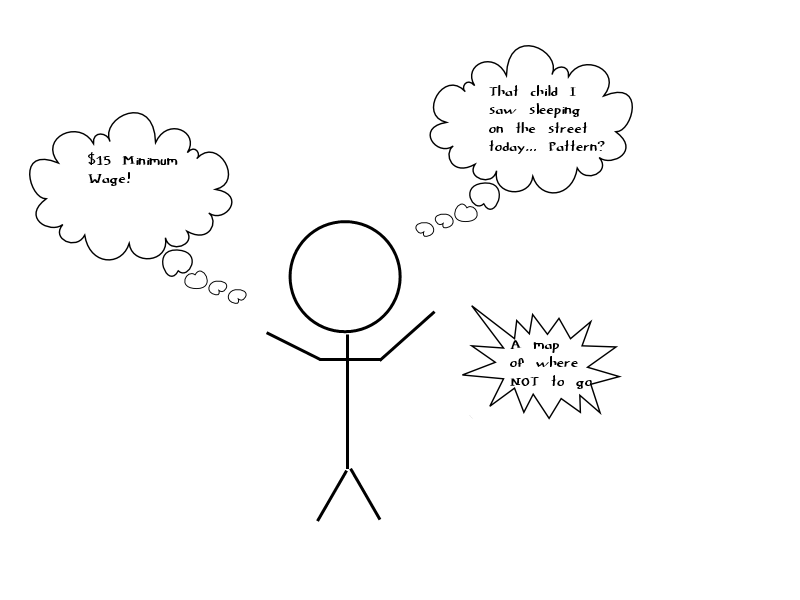

## A New Kind Of Journalism

- Data Science team for the city of Seattle
- interdisciplinary team composed of 4 roles: Data Scientists, Creatives, Journalists, and Developers.
- Data Driven discussions on the Quality of programs

## Conceptualize the Workflow
- Trying to understand homelessness given the data sets: depressing.
- The answer to questions where data quality is poor (or doesn't exist) may be, "help us obtain more data". 
- http://rwac.guru is a conversation between citizens and the data science team. 


## wide range of possible questions
- To what degree can we answer citizen questions?


## plan

- Today we will generate several citizen questions (1/2 hour)
- Next is data exploration (1/2 hour) - data.seattle.gov 
- Design and development of assets
- Publish

## Creative Responsibility

- Infographics
- Cartoons 

## Developers

- d3 data visualizations
- Map visualizations (leaflet, d3, etc)
- single page site with various pivots on assets, similar to data.seattle.gov

## Data Scientists - insights into data

- Statistical analysis, prediction, summarization using available datasets
- Clean and publish datasets obtained from non-profits 

## Journalists

- Interaction with the citizen
- Interaction with the non-profits and organizations, obtaining data

## The Rebel without a cause


## the guru is the team behind the curtain

- we will recommend work to users (most are looking for something to do)
- we will recommend upward mobility to the poor
- do we have the right data sets to do this? No,  not yet. 

## good assets 
<div><iframe width="500px" title="SeattleCrime" height="425px" src="https://data.seattle.gov/w/fgy8-byjy/2myu-6xk5?cur=gnSzaeVKuZO&from=root" frameborder="0" scrolling="no"><a href="https://data.seattle.gov/Public-Safety/SeattleCrime/fgy8-byjy" title="SeattleCrime" target="_blank">SeattleCrime</a></iframe></div>


## Seattle Department Expenditure rollup
<div><iframe width="500px" title="Department Rollup - Pie Chart" height="425px" src="https://data.seattle.gov/w/sfv9-ahhf/2myu-6xk5?cur=i9QiT5MDj4f&from=root" frameborder="0" scrolling="no"><a href="https://data.seattle.gov/Finance/Department-Rollup-Pie-Chart/sfv9-ahhf" title="Department Rollup - Pie Chart" target="_blank">Department Rollup - Pie Chart</a></iframe></div>

## Git Repo
https://github.com/PaulMineau/rwac.git
I generated this slideshow entirely in R Studio using knitr. The git repository for this site is at 
Pushing to the repo will automatically deploy all content to the website. 

All datasets so far from <a href="http://data.seattle.gov">data.seattle.gov</a>


## http://rwac.guru - insight from data
```{r, echo=FALSE}
require(graphics)
## give the data set in the form it is used in S-PLUS:
longley.x <- data.matrix(longley[, 1:6])
longley.y <- longley[, "Employed"]
pairs(longley, main = "longley data")
```

Do you want to party with the data sets? Epic data party.
